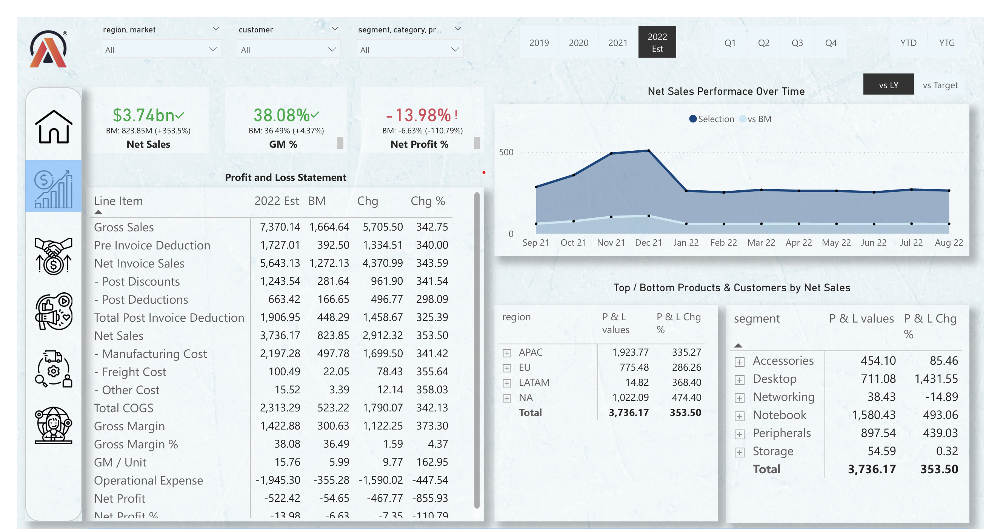
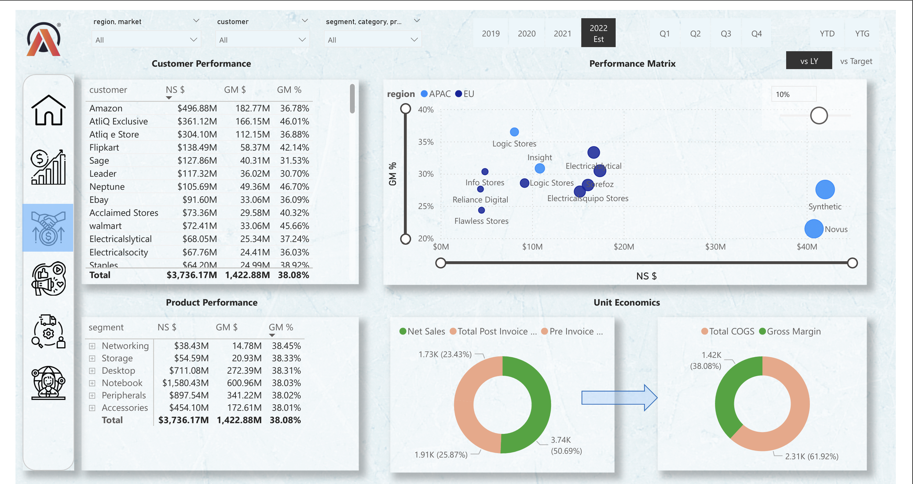
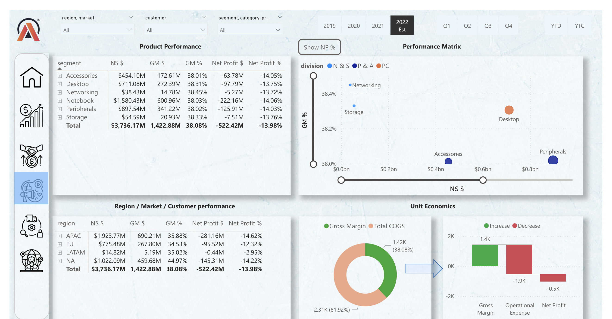
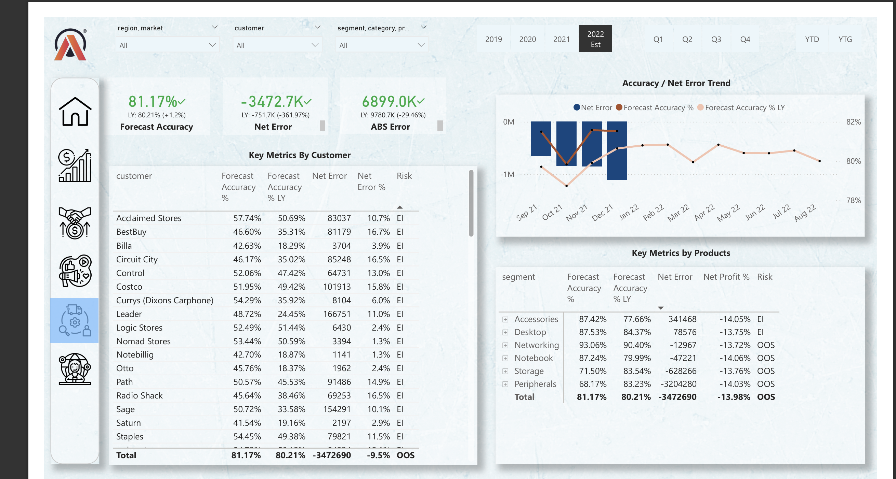
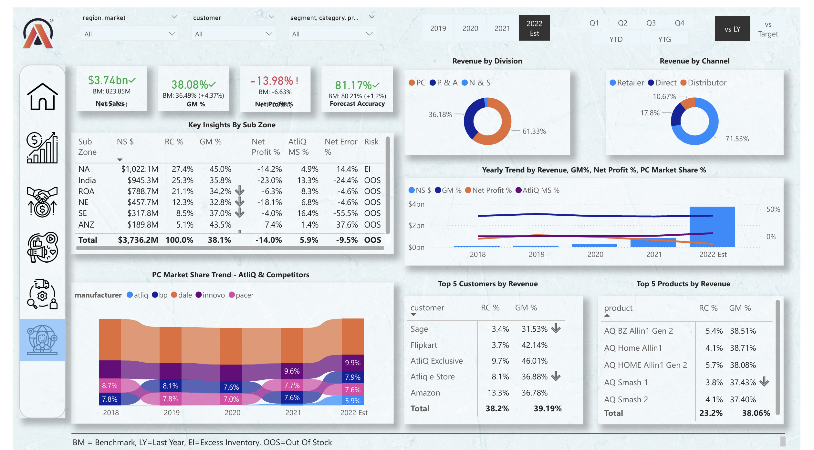
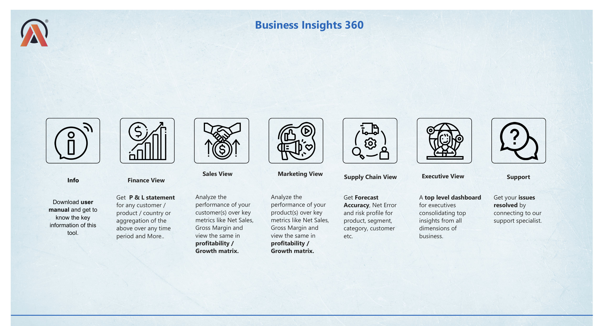

# 📊 Business Insights 360 Dashboard – Power BI Project

A real-time, interactive Power BI dashboard built for **AtliQ Hardware**, a fast-growing global consumer electronics company. This project was developed to transform slow and outdated Excel-based reporting into a centralized, insight-driven BI system that empowers business leaders to make informed decisions across departments.

---

## 🚩 Problem Statement

AtliQ Hardware faced the following challenges:

- Relied on Excel for reporting, which was time-consuming and prone to delays
- Limited visibility into business performance across finance, sales, marketing, and supply chain
- Incurred market losses due to lack of timely insights, especially in Latin America

---

## 🎯 Project Objective

To replace Excel-based reporting with a modern Power BI solution that:

- Unifies data from MySQL and Excel
- Delivers real-time dashboards
- Supports data-driven decisions across departments
- Improves operational efficiency and market responsiveness

---

## 🗂️ Dashboard Views & Highlights

| View                     | Key Focus Areas & Insights                                                                                                                                                                                                                                                                     |
| ------------------------ | ---------------------------------------------------------------------------------------------------------------------------------------------------------------------------------------------------------------------------------------------------------------------------------------------- |
| 📊 **Finance View**      | Tracks core financial KPIs including Net Sales, Gross Margin %, and Net Profit % over time. Includes a simplified Profit & Loss (P&L) summary. Enables stakeholders to evaluate financial performance across months and identify trends or anomalies.   |
| 📈 **Sales View**        | Analyzes customer and product-level sales performance using metrics like Net Sales and Gross Margin. Helps identify high-performing vs underperforming products/customers, enabling sales strategy optimization.                                            |
| 📢 **Marketing View**    | Evaluates marketing impact by reviewing profitability of products and customer segments. Highlights areas where net profit and gross margin % can be improved through better promotional targeting or pricing.                                      |
| 🚚 **Supply Chain View** | Focuses on demand planning and inventory optimization using metrics like Forecast Accuracy, Net Error, and Absolute Error. Helps the supply chain team anticipate demand fluctuations and reduce inventory costs.                              |
| 📋 **Executive View**    | Provides a high-level summary of overall business performance including Revenue, Gross Margin %, Net Profit %, and Market Share %. Showcases top 5 customers and products by revenue, giving leadership a strategic overview at a glance.             |

---

## 🧰 Tools & Technologies Used

- **Power BI Desktop & Service** – Dashboard creation and sharing
- **Power Query** – Data cleaning and transformation
- **DAX & DAX Studio** – Advanced measures and performance tuning
- **MySQL + Excel** – Data sources integration
- **Bookmarks, Tooltips, Conditional Formatting, Dynamic Titles** – UX enhancements
- **Auto-refresh & Navigation Buttons** – Real-time updates and smooth user experience
- **ChatGPT** – DAX optimization and logic guidance

---

## 📌 Key Learnings

- Created custom **DAX measures** and **calculated columns** for business logic
- Designed interactive features like **bookmarks, tooltips**, and **navigation**
- Enhanced stakeholder engagement with **clear storytelling and KPI-driven insights**
- Enabled **auto-refresh** via gateway for up-to-date data availability

---

## 📘 Business Terms Learned

**Net Sales**, **COGS**, **Gross Margin %**, **Net Profit %**, **Market Share %**,  
**Forecast Accuracy**, **YTD/YTG**, **Distributor vs. Retailer**, **Benchmarking**, and more

---

## 📸 Screenshots

  
  
  
  
  

---

## 🔗 Project Links

- 🔴 [Live Dashboard](https://encr.pw/e8IvB)

---

## 🙏 Acknowledgements

Special thanks to [@Dhaval Patel](https://www.linkedin.com/in/dhavalpatel/) and [@Hemanand V](https://www.linkedin.com/in/hemanandv/) at Codebasics for mentorship and guidance throughout this project.

---

> This project is part of the **Codebasics Power BI Bootcamp**  
> 📅 Completed: July 2024 | 💼 Role: Aspiring Data Analyst
